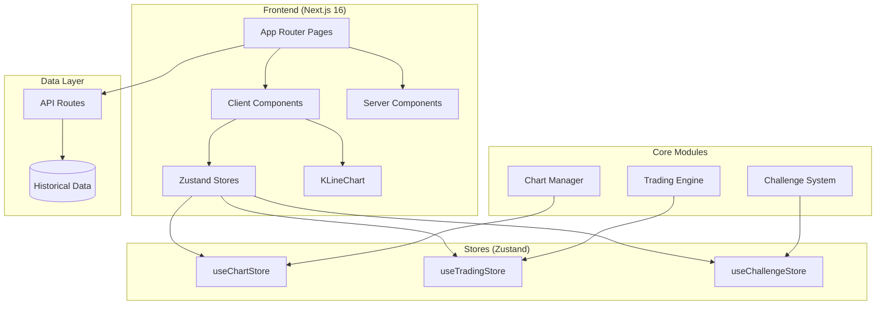
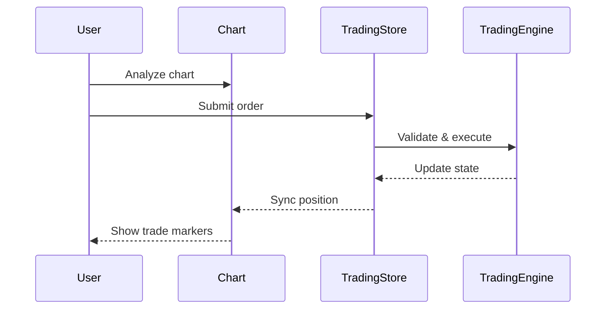
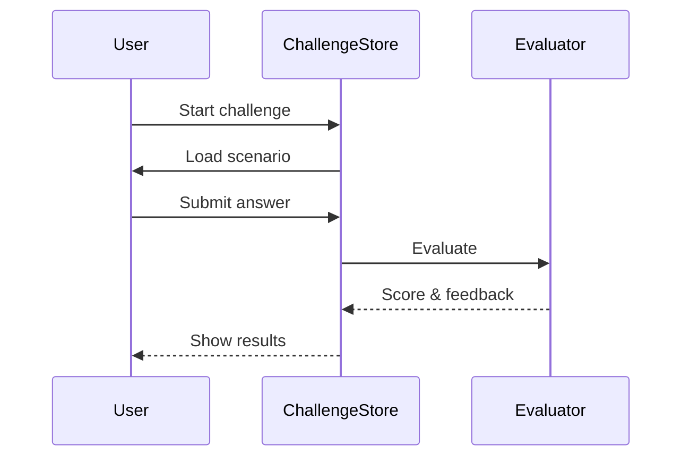

# M8Traders Platform Architecture

> Quick reference for project structure and patterns

---

## System Overview



---

## Route Groups

| Group | Path | Purpose |
|-------|------|---------|
| `(auth)` | `/login`, `/register` | Authentication |
| `(dashboard)` | `/`, `/profile`, `/stats` | User dashboard |
| `(simulation)` | `/sim/*` | Trading simulator |
| `(learn)` | `/learn/*` | Learning modules |
| `(challenges)` | `/challenges/*` | Challenge system |

---

## Data Flow

### Trading Simulation Flow


### Challenge Flow


---

## Key Components

### Chart (KLineChart)
- `TradingChart.tsx` - Main chart wrapper
- `ChartControls.tsx` - Timeframe, indicators
- `DrawingTools.tsx` - Line, fib, patterns

### Trading Panel
- `OrderPanel.tsx` - Buy/Sell form
- `PositionDisplay.tsx` - Current position
- `TradeHistory.tsx` - Past trades

### Challenge System
- `ChallengeCard.tsx` - Challenge preview
- `ChallengePlayer.tsx` - Active challenge
- `ScoreDisplay.tsx` - Results & feedback

---

## Store Schemas

### ChartStore
```typescript
{
  ticker: string;
  timeframe: Timeframe;
  indicators: Indicator[];
  drawings: Drawing[];
  theme: 'dark' | 'light';
}
```

### TradingStore
```typescript
{
  balance: number;
  position: Position | null;
  trades: Trade[];
  stats: TradingStats;
}
```

### ChallengeStore
```typescript
{
  activeChallengeId: string | null;
  progress: Map<string, ChallengeProgress>;
  scores: ChallengeScore[];
}
```

---

**Last Updated**: 2026-01-12
