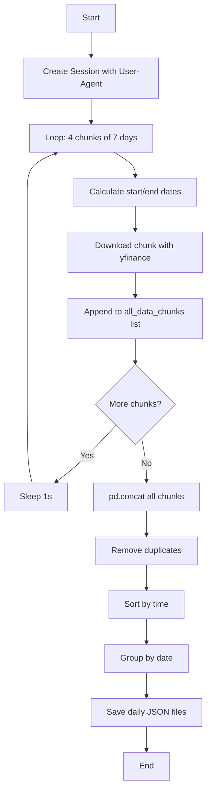

# Yahoo Finance Data Harvester (7-Day Chunking)

## The 7-Day Limit Problem

Yahoo Finance API now restricts 1-minute data to **7 days per request**:

> "Only 7 days worth of 1m granularity data are allowed to be fetched per request."

## Solution: Chunk & Merge Strategy

This script bypasses the limit by:
1. **Chunking**: Loop through multiple 7-day windows
2. **Merging**: Combine all chunks with `pd.concat()`
3. **Cleaning**: Remove duplicates and sort by time

---

## Setup

### Install Dependencies

```bash
cd C:\Users\laras\.gemini\antigravity\scratch\m8traders-platform\scripts

pip install -r requirements.txt
```

**Dependencies:**
- `yfinance` >= 0.2.40
- `pandas` >= 2.0.0
- `requests` >= 2.31.0

---

## Usage

### Basic (28 Days = 4×7 Chunks)

```bash
python harvest_yfinance.py
```

Downloads all default IDX stocks for the last **28 days** in **4 chunks** of 7 days each.

### Custom Period

```bash
# 21 days (3 chunks)
python harvest_yfinance.py --days 21

# 14 days (2 chunks)
python harvest_yfinance.py --days 14
```

**Important**: `--days` must be a **multiple of 7** (7, 14, 21, 28, etc.)

### Specific Tickers

```bash
python harvest_yfinance.py --tickers BBCA.JK TLKM.JK --days 14
```

### Clean Old Files First

```bash
python harvest_yfinance.py --clean
```

---

## How Chunking Works

### Example: 28 Days Download

The script runs **4 iterations**:

```
Chunk 1: 2025-01-15 to 2025-01-08 (7 days)
  ⏳ Wait 1s...
Chunk 2: 2025-01-08 to 2025-01-01 (7 days)
  ⏳ Wait 1s...
Chunk 3: 2025-01-01 to 2024-12-25 (7 days)
  ⏳ Wait 1s...
Chunk 4: 2024-12-25 to 2024-12-18 (7 days)
```

**Then merges all chunks:**
```python
df_merged = pd.concat(all_data_chunks)
df_merged = df_merged[~df_merged.index.duplicated(keep='first')]  # Remove duplicates
df_merged = df_merged.sort_index()  # Sort by time
```

---

## Anti-Bot Protection

### 1. Custom Session with Browser User-Agent

```python
session = requests.Session()
session.headers.update({
    'User-Agent': 'Mozilla/5.0 (Windows NT 10.0; Win64; x64) ...',
    'Accept': 'text/html,application/xhtml+xml...',
    'Accept-Language': 'en-US,en;q=0.9',
})
```

### 2. Pass Session to yfinance

```python
stock = yf.Ticker(ticker, session=session)
df = stock.history(start=start_date, end=end_date, interval='1m')
```

### 3. Polite Delays

- **1 second** between chunks (same ticker)
- **2 seconds** between tickers (configurable with `--delay`)

---

## Output Format

### File Structure

```
public/simulation-data/
├── BBCA_2025-01-08.json
├── BBCA_2025-01-09.json
├── BBCA_2025-01-10.json
└── TLKM_2025-01-10.json
```

### JSON Schema

```json
[
  {
    "time": "09:00",
    "open": 9800.0,
    "high": 9850.0,
    "low": 9780.0,
    "close": 9820.0,
    "volume": 150000
  },
  {
    "time": "09:01",
    "open": 9820.0,
    ...
  }
]
```

---

## Troubleshooting

### Error: "Only 7 days worth of 1m data allowed"

**Cause**: Using old script with `period='1mo'`

**Solution**: Use the new chunked script which downloads in 7-day windows

### No data for recent days

**Cause**: Market closed or data not yet available

**Solution**: 
- Run during/after market hours
- Try `--days 14` for more recent data

### "days must be multiple of 7"

**Cause**: Invalid `--days` value

**Solution**: Use 7, 14, 21, 28, etc.

```bash
# ❌ Wrong
python harvest_yfinance.py --days 30

# ✅ Correct
python harvest_yfinance.py --days 28
```

---

## Script Workflow



---

## Example Output

```
🚀 Yahoo Finance IDX Stock Harvester (Chunked Download)
============================================================
📊 Tickers: BBCA.JK
⏱️  Interval: 1m
📅 Days: 28 (in 4 × 7-day chunks)
📁 Output: C:\...\public\simulation-data
============================================================

✅ Created session with Browser User-Agent

============================================================
📥 Downloading BBCA.JK (1m interval, 28 days)
   Strategy: Chunked download (7-day windows)
============================================================

  📦 Chunk 1/4: 2025-01-08 to 2025-01-15
     ✅ Got 1890 candles
     ⏳ Waiting 1s...

  📦 Chunk 2/4: 2025-01-01 to 2025-01-08
     ✅ Got 1950 candles
     ⏳ Waiting 1s...

  📦 Chunk 3/4: 2024-12-25 to 2025-01-01
     ✅ Got 780 candles
     ⏳ Waiting 1s...

  📦 Chunk 4/4: 2024-12-18 to 2024-12-25
     ✅ Got 1950 candles

  🔗 Merging 4 chunks...
  🧹 Removed 12 duplicates

✅ Final dataset: 6558 candles
   Date range: 2024-12-18 09:00:00 → 2025-01-15 16:00:00

  💾 Saving daily JSON files...
     BBCA_2024-12-18.json (390 candles)
     BBCA_2024-12-19.json (390 candles)
     ...
     BBCA_2025-01-15.json (390 candles)

============================================================
📊 HARVEST COMPLETE
============================================================
✅ Successful: 1 tickers
📄 Total JSON files: 18
📁 Output directory: C:\...\public\simulation-data
============================================================
```

---

## Advanced Options

### Increase Ticker Delay (if getting blocked)

```bash
python harvest_yfinance.py --delay 5.0
```

### Download Only Specific Days

```bash
# Get only last 2 weeks
python harvest_yfinance.py --days 14 --clean
```

### Combine with Custom Tickers

```bash
python harvest_yfinance.py \
  --tickers BBCA.JK BBRI.JK \
  --days 21 \
  --delay 3.0 \
  --clean
```
